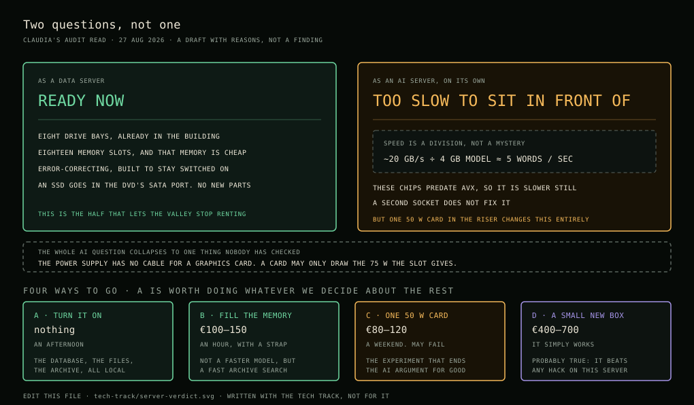

# Can it be our data and AI server?

An audit read of the machine in the makerspace, written by ClaudIA on
27 August 2026, from [the six recordings](server.md) and nothing else. Nobody
has opened it, booted it, or read its label yet, so **this is a draft with
reasons attached, not a finding.** It is here so the tech track has something
concrete to argue with instead of starting from a blank page.

Confidence marks work the same as in the [server map](server.md):
✅ checked · 🟡 reasoned, not checked · ❓ nobody knows yet.



---

## The short version

**The question has two halves, and they have different answers.**

As a **data server** it is ready now and it is genuinely good at the job. Lots
of disks, lots of memory slots, error-correcting memory, built to stay on. This
is the half that lets the valley stop renting. 🟡

As an **AI server running a language model**, it is weak in a specific and
measurable way, and one cheap card would change that. Not "buy a better
server". One card, if it fits and if the power works out. 🟡

So the honest recommendation is: **do the data half now, and treat the AI half
as one experiment with a known cost and a known way to fail.** Do not wait for
the second to start the first.

---

## Why the AI half is weak, with the arithmetic

Generating text is not limited by how clever the processor is. It is limited by
**how fast the machine can read the model's weights out of memory**, once per
word. So the speed is close to a division:

```
words per second  ≈  memory bandwidth  ÷  size of the model in memory
```

For this machine, if it is the platform we think it is: 🟡

- Memory is **DDR3 in three channels per processor**. Peak is around 32 GB/s
  per socket, and real measured throughput on hardware of this age lands nearer
  **20 to 25 GB/s**.
- A 7-billion-parameter model, compressed to 4 bits, is about **4 GB**.
- 20 ÷ 4 is **about five words per second.**

Five words per second is slower than reading aloud. It is fine for something
working through a pile of documents overnight. It is not fine for anybody
sitting in front of it waiting.

**There is a second problem and it is worse than the first.** Processors of this
era predate a set of instructions called AVX, which almost every local model
runner is built around today. Without them the software falls back to older,
slower paths. 🟡 So the five is optimistic, not conservative.

Adding both processors does not fix it. Memory on a two-socket machine is split
between them, and a model spread across both spends its time asking the other
socket for data. Two sockets help with many small jobs at once. They do not
make one model twice as fast. 🟡

**None of this applies to a graphics card**, which brings its own memory at ten
to twenty times the bandwidth. Which is why the whole AI question collapses down
to one hardware question.

---

## The one thing that decides it

Machines like this were built before anybody put graphics cards in servers, so
**the power supply has no separate cable for one.** ❓ A card can only draw what
the slot itself gives, which is 75 watts. Most graphics cards want two to four
times that.

That sounds like a dead end and it is not, because a whole category of card
exists for exactly this situation: single-slot, low-profile, no power cable,
passively cooled by the chassis fans, sold by the thousand into old racks.

| Card | Memory | Draws | Roughly |
|---|---|---|---|
| Tesla P4 | 8 GB | 50 W | cheap, secondhand, everywhere |
| Tesla T4 | 16 GB | 70 W | several times the price, much newer |

Either one would run a 7 to 13 billion parameter model at conversation speed
rather than at five words per second. 🟡 The P4 is the honest first try because
if it does not work you have spent very little to find that out.

**What has to be true, and nobody has checked any of it yet:**

- ❓ A free slot on a riser, and whether it is full height or low profile
- ❓ Whether the slot is wired for enough lanes to be worth it
- ❓ Whether the firmware will start the machine at all with such a card in it.
  Old server firmware sometimes refuses newer cards, and this is the failure
  that wastes a weekend
- ❓ Whether the fans speed up for a card they were never told about, or leave
  it to cook
- ❓ Whether the power supply has headroom once the disks spin up

---

## Four ways to go, and what each costs

Not exclusive. Most likely we do A regardless, and then choose between C and D.

### A. Turn it on and let it hold our data 🟡

Cost: nothing, plus electricity. Effort: an afternoon.

Put Linux on it, and start moving the things the valley currently rents onto
it: the database, the files, the archive, git. Bryan already found the way in
without touching anything: **the DVD drive sits on a normal SATA port**, so an
SSD goes there for the system while the eight bays stay as bulk storage. That
one detail is worth more than any new part.

Unlocks: the valley stops paying rent for the boring half of its infrastructure.

### B. Fill the memory 🟡

Cost: roughly €100 to €150. Effort: an hour, with an antistatic strap.

Eighteen slots, and memory this old is nearly free secondhand. Going to 100 GB
or beyond costs less than a month of hosting. It will not make a language model
fast, but it makes the database and the search index fast, and those are what
we use every day.

Unlocks: a real database, big caches, and searching our own archive quickly.

### C. One low-power card, as an experiment 🟡

Cost: roughly €80 to €120 for a P4. Effort: a weekend, and it might not work.

This is the experiment that answers the AI question for good. Frame it as an
experiment with a budget rather than as a plan, because four of the five
unknowns above could each end it.

Unlocks: a language model at usable speed, in the building, offline.

### D. Do not run the model on this machine at all 🟡

Cost: roughly €400 to €700 secondhand. Effort: none, it just works.

Worth saying plainly because it is probably true: **an ordinary used desktop
with a modern graphics card will beat anything we can do to this server**, and
it will be quiet and cheap to leave on. The server would then do what it is
genuinely excellent at, which is holding disks and memory and staying up, and
hand the thinking to the small box next to it.

Unlocks: the fastest path to a working local model, at the cost of a second
machine to look after.

---

## What an audit has to say out loud

The things that do not come up when everybody is excited about the machine.

- **Electricity is the real running cost.** A machine like this draws somewhere
  around 150 watts doing nothing. At €0.30 per kilowatt-hour that is roughly
  **€390 a year to leave switched on**, before it does any work. 🟡 Somebody
  should replace that price with what the Hof actually pays, and then decide
  whether that number is smaller or larger than what we currently pay to rent
  the same services. It might well be smaller. It should be a number, not a
  feeling.
- **It is loud.** Small fans spinning fast is how 2U servers stay cool. 🟡 Fine
  in the makerspace, not fine anywhere near where people sleep. Measure it with
  a phone before deciding where it lives.
- **The remote management card must never face the internet.** These machines
  have a small always-on computer inside them for remote control, and on
  hardware of this generation it is old, unpatched, and a known way in. ❓ It
  belongs on its own isolated network, or switched off. This is the single
  security thing to get right before the machine is reachable from anywhere.
- **Expect some disks to be dead.** Drives that have been sitting unpowered for
  years do not all come back. ❓ Plan on it rather than being surprised, and do
  not put anything that matters on the array until it has been running for a
  fortnight without complaint.
- **The storage controller may have a flat battery.** If it does, it turns its
  own write cache off to protect data, and writing becomes very slow for no
  obvious reason. ❓ It is a known trap and a cheap part. If the array feels
  inexplicably slow, this is the first thing to check.
- **A guess written down is not a fact.** Everything above rests on the machine
  being what [the server map](server.md) infers from eighteen memory slots. Pull
  the service tag first. If it is a different machine, most of the numbers here
  change and this page needs rewriting.

---

## What to measure, in order, before spending anything

Cheap first, and each one kills questions further down the list.

| # | Do this | Takes | Answers |
|---|---|---|---|
| 1 | Slide out the service tag on the front | 2 min | What machine this actually is |
| 2 | Plug it in and see if it starts | 15 min | Whether any of this is worth planning |
| 3 | `sudo dmidecode -t system -t processor -t memory` | 5 min | Real processors, real memory, real free slots |
| 4 | `lspci` | 2 min | Names the Dell card and the "security PIM" |
| 5 | A plug-in power meter, idle and busy | a day | The yearly electricity number |
| 6 | Phone sound meter at one metre | 1 min | Whether it can live where we want it |
| 7 | Open the lid, look at the risers | 10 min | Whether a card fits, and which one |
| 8 | Read all eight drive labels | 5 min | Ends the 146 versus 500 argument for good |

Steps 1 to 4 are one visit and answer most of this page.

---

## Corrections

This page is a machine's reading. It is meant to be overwritten by people who
went and looked. Add a row, sign it, and change the section it refers to. The
original stays in the recordings, which are the record.

| What was wrong | What is actually true | Who checked | When |
|---|---|---|---|
| | | | |

---

*Written with the tech track, not for it. Argue with it in the open, or open a
pull request and change it.*
