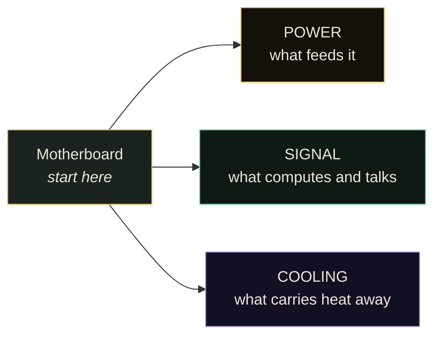
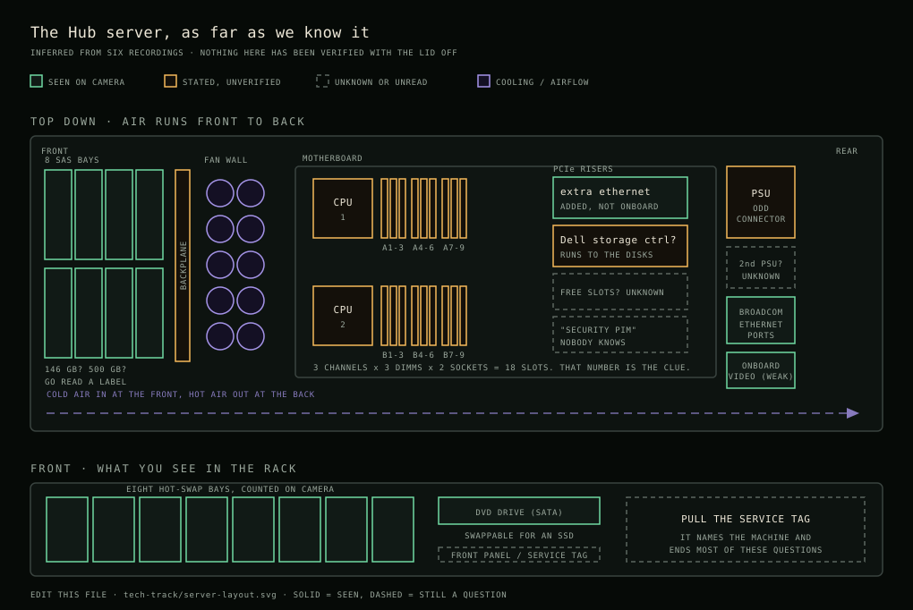
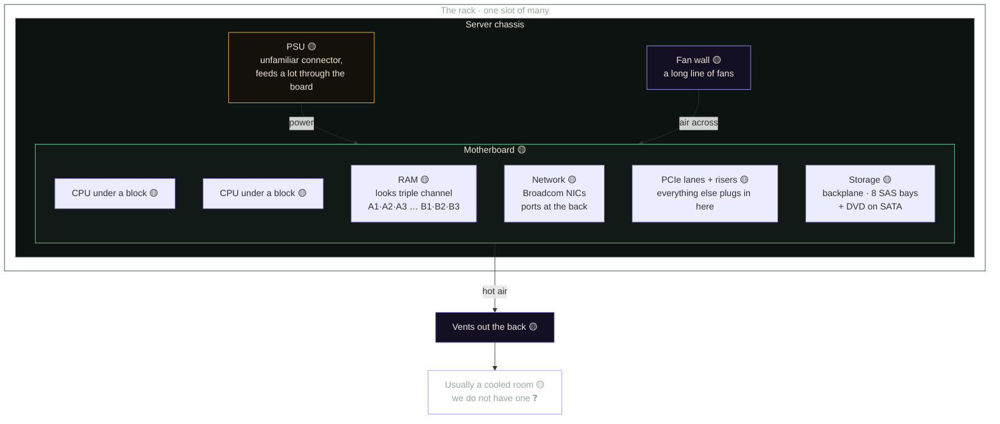

# The server, read three ways

The Hub has a rackmount server standing in the makerspace. This is a map of it,
started from Bryan's walk-around on 27 August 2026 and meant to be corrected by
whoever opens it next.

The walk-around is five recordings, about nine and a half minutes: the format
and the method, RAM and cache, handling and the board, PCIe and SATA, then the
drive bays. All five are in the Hub.

**Read this before you trust it.** Bryan was seeing the machine for the first
time and said so twice: *"everything I say here, take it with a grain of salt"*
and *"as I talk, I'm figuring out what needs to be done"*. Everything below is
marked for how sure we are. **Nothing here has been verified against the
hardware with the lid off.**

| mark | means |
|---|---|
| ✅ | confirmed by someone who checked the machine |
| 🟡 | Bryan said it while looking at it, unverified |
| ❓ | open question, nobody knows yet |

---

## Before you touch it

The most important thing in the recordings, and the only part that is not a
guess. 🟡 as stated, but it is standard practice rather than a reading of this
machine.

- **Hold a RAM stick by its edges. Do not touch the gold pins.**
- **Wear an anti-static strap.** Ground yourself first.
- **Take your sweater off.** Static you cannot feel is enough.
- **Do not stack sticks on each other or throw them around.**

The reason, in Bryan's words: you do not want to destroy a thousand pounds of
RAM with a spark. Everything else in this document can be got wrong and fixed.
This cannot.

---

## The method

Bryan's, not ours, and it is the most portable thing in the recording. Any
computer breaks into **three systems**. Start at the motherboard and work
outwards through each in turn.

A server is not a different kind of machine, it is a different **shape** of one.
ATX and ITX are the desktop formats; this is a server format built to slide into
a rack with other machines stacked above and below. 🟡

---

## The machine

Two drawings. The one below is the physical layout, drawn to scale-ish and
meant to be edited: [`server-layout.svg`](server-layout.svg). Solid outlines
are things visible in the recordings, amber is something someone said but
nobody checked, dashed is an open question.

The one after it is the same machine as a flow of power, signal and air.

If what you actually want to know is *can we run our data and our own language
model on this*, that question has its own page:
**[Can it be our data and AI server?](can-it-be-our-ai-server.md)**

---

## 1. Power 🟡

The PSU is the power supply unit. Bryan flagged the connector as one he had not
seen before: rather than a long cable running out to every device separately, a
lot appears to be fed **through the motherboard**. He marked this as a guess and
so do we.

- 🟡 PSU present, appears to feed most things via the board
- ❓ Wattage, redundancy, whether there are two PSUs (common in servers)
- ❓ Whether anything still needs cabling. It was working when it was last set
  up, and nobody in the room at the time could confirm its current state
- ❓ Input: what it expects from the wall, and what the makerspace circuit gives

## 2. Signal 🟡

Everything that computes or carries data.

**Processors**

- 🟡 At least two CPUs, sitting under the cooling blocks
- 🟡 A CPU is a square of silicon under a metal lid, pasted to the heat sink
- 🟡 Modern CPUs carry L1, L2 and sometimes L3 cache, a few megabytes. It keeps
  growing because cache is a cheap way to displace the need for RAM and it
  lifts the performance that is still CPU-bound. It is etched onto the chip
  itself
- ❓ Model, core count, generation. Under the blocks, and reading it means
  redoing thermal paste

**Memory** — the most interesting reading of the session

- 🟡 Normally a board is **dual channel**: you populate slots in pairs
- 🟡 This board's slot colours run in **threes**, and the silkscreen reads
  `A1 A2 A3` then `A4 A5 A6` then `A7 A8 A9`, with a matching `B` bank
- 🟡 Bryan reasons from that pattern that it looks like **triple channel**:
  populate one, two and three together rather than in pairs
- ⚠️ He said out loud he was not certain triple channel exists. It does, on
  some server platforms. **This is reasoning from the board, not a
  specification**, and it is checkable in ten minutes against the board model
- ❓ How many sticks are fitted, what size each is, how many slots are free
- ❓ Whether it is ECC, which server RAM usually is

**Network**

- 🟡 The network interface chips are **Broadcom**, on the board itself
- 🟡 Ethernet ports are at the back
- ❓ How many, and at what speed

**Expansion**

- 🟡 Most of what you plug into a server goes through **PCIe lanes**
- 🟡 There are risers, with a release catch. The recording ends with him
  working out whether one is seated or free, so that is unfinished
- ❓ How many lanes, how many slots, what is already in them

**Storage** — found, and it decides what this machine is for

- 🟡 A **backplane**: a module carrying a stack of drives, most likely in some
  kind of RAID array
- 🟡 The caddies are for **SAS**, Serial Attached SCSI, which Bryan describes
  as better than SATA
- 🟡 **Eight drive bays**, counted on camera
- ⚠️ **Capacity is unresolved.** He reads 500 off a drive front, which would
  make about 4 TB across eight bays. But he then compares them to 8 TB drives
  and says those are *56 times* bigger, which points at roughly 146 GB, a
  common SAS size. Both cannot be right. **Read a label.**
- 🟡 There is also a **DVD drive** on SATA, still fitted, eject button
  reachable from the front. That port takes any SATA device, so it can become
  an SSD or a hard disk whenever somebody wants the bay
- ❓ How many bays are populated, and whether the RAID is configured

**Expansion, in more detail**

- 🟡 A PCIe generation is bandwidth plus the protocol for moving data down the
  lanes. It keeps rising because graphics cards keep demanding it
- 🟡 Channels are written like `PCIe 5 x16`: all sixteen channels of a gen-5
  lane. A x16 slot can be **split**, for example into two x8, so a card
  needing only eight does not waste the rest
- 🟡 Everything extra attaches by **PCIe or SATA**

### The riser bay 🟡

A riser turns one slot on the board into several, angled so the cards lie flat
in a 2U chassis. Whoever built this machine used that room for **more ethernet
rather than a graphics card**, which is a choice worth noticing: it was set up
to move traffic, not to compute on the GPU.

- 🟡 Extra ethernet cards on a riser, added, not onboard
- 🟡 An onboard display adapter, which Bryan dismissed on sight as old and weak.
  For anyone hoping to run models here: the video that comes with the board is
  not the video you would use. A real GPU would go in the riser
- ❓ **A Dell card whose cabling seems to run to the disk arrays.** Bryan's best
  reading is a storage controller. He asked Jeff directly, at the table, and
  got no answer. This is the single most useful unknown in the machine, because
  a RAID controller decides how the eight bays behave
- ❓ Something reading **"security PIM"**. Nobody in the room could name it
- ❓ How many riser slots are free

## 3. Cooling 🟡

The part that makes a server look like a server.

- 🟡 A long fan wall pushes air across the board and out through the back
- 🟡 Passive blocks over the CPUs. They come off, but the **thermal paste has to
  be redone** if they do
- 🟡 Full racks normally sit in a refrigerated room
- ❓ We do not have a cooled room. Where this machine lives, and how loud it is
  where it lives, is an open question and probably the first practical one
- 🟡 Water cooling is the alternative: a block that moves heat into flowing water

---

## Which machine is it, probably 🟡

Nobody has read the label yet, so this is a reading of the machine from the
recordings alone. It is a guess with reasons attached, and it is written down
so someone can knock it over in thirty seconds.

**The tell is the memory slots.** Bryan reads them out loud: `A1 A2 A3`,
`A4 A5 A6`, `A7 A8 A9`, and then a second bank starting at `B`. Nine per
processor, in groups of three, across two processors. Eighteen slots.

That layout is not a general server pattern, it is a specific one. Three
memory channels per processor, three slots per channel, two sockets. Intel
built desktop and server chips that way for a fairly short window, and on the
server side that means the Xeon 5500 and 5600 families, on the socket called
LGA1366, sold roughly between 2009 and 2012. 🟡

Everything else in the recordings sits comfortably on top of that:

| What was seen | What it narrows |
|---|---|
| Eight hot-swap bays, small SAS disks | 2U chassis, 2.5" backplane |
| A **Dell** card on the riser, cabled toward the disks | a Dell PERC RAID controller |
| Broadcom network chips on the board | standard for Dell of that period |
| Onboard video described as old and weak | matched to a service processor, not to graphics |
| A DVD drive on SATA | front-panel optical bay |

Put together, the machine that fits best is a **Dell PowerEdge R710**, or its
1U sibling the R610 if the bay count turns out to be six rather than eight. ❓

**This also settles the argument about disk size.** Bryan says the modern
8 TB drives are "56 times bigger than this," and somebody else reads "500" off
a label. Those two do not agree. But 8 TB divided by 56 is about 143 GB, and
**146 GB was the ordinary SAS disk sold in these machines.** So the arithmetic
and the platform point the same way, and the "500" is most likely off a
different label on a different drive. Nothing here is settled until someone
reads eight labels and writes down eight numbers.

### How to knock this over

Two ways, both cheap, either one ends the guessing:

1. **Pull the tag.** On the front, usually near the bays, there is a small
   plastic card that slides out. It carries a service tag. That tag names the
   exact machine, and on Dell's site it names the parts it shipped with.
2. **Ask the machine.** If it boots to anything Linux, `sudo dmidecode -t
   system -t processor -t memory` prints the model, the processors and every
   populated slot without opening the lid.

If the answer is different from what is written above, change this section and
say who checked. That is the whole point of writing the guess down.

### If it is an R710, what follows

Not conclusions, just the things that would then be worth planning around. 🟡

- The memory is DDR3 and registered, which is old but cheap secondhand. Filling
  eighteen slots is unusually affordable on this platform.
- Two Xeons of that era are still perfectly good at serving files, running
  databases and holding an archive. They are slow at anything a modern GPU
  would do.
- It draws real power and makes real noise even when idle. That is a room
  question before it is a computing question, and the cooling section already
  flags that we do not have the room these were built for.
- A GPU is possible in the riser but constrained by the 2U height and by what
  the PSU will give. Worth measuring before anybody buys a card.

---

## What is actually blocking

In the order somebody could clear them.

| # | question | who could answer |
|---|---|---|
| 1 | Does it still need power cables? | whoever set it up, or whoever opens it next |
| 2 | Who can mount it in a rack? | open |
| 3 | Where does it live, given the noise and no cooled room? | the house |
| 4 | Is the RAM really triple channel, and how is it populated? | the board model, ten minutes |
| 5 | How big are the drives really, 500 GB or 146 GB? | read a label, two minutes |
| 6 | Is that riser seated or released? | whoever opens it next |
| 7 | How many of the eight bays are populated, and is the RAID configured? | whoever boots it |
| 8 | What is it for? See below | the tech track |

## What it could be for

Nothing here is decided, but the drive bays narrow it considerably. **Eight
bays of SAS disks is a lot of spindles and not many terabytes.** That is a poor
bulk storage box and a good archive one, and somebody in the room said the
useful thing out loud: *it is Markdown files.* For a text archive four
terabytes is enormous. The limit only bites for media or heavy relational data.

Listed so two people do not build the same half. Costs, arithmetic and the four
ways to go are worked through in
[Can it be our data and AI server?](can-it-be-our-ai-server.md).

- **The thing the valley stops renting.** Everything currently depends on an
  uplink to a hosted database and an edge network. A machine in the building is
  the biggest single change available to that.
- **A local archive node.** The same knowledge, fast and offline, on a box in
  this building. See Build 2 in the [projects index](https://github.com/Valley-of-the-Commons/projects).
  **This is the role the hardware actually fits.**
- **Permanent storage.** Build 1. Possible, but the bays are the constraint:
  this is not where a lot of terabytes live without new disks.
- **The thing Rolling Rob and the LoRa devices talk to** when the internet is
  not there.

---

## How to correct this

Open it, look, and change the marks. A 🟡 that you verified becomes ✅ with your
name beside it. A ❓ you answered becomes a line of fact. If Bryan got something
wrong, say so plainly and leave the original in the recording, which is the
record.

The recordings live in the Hub:

1. **Bryan opens the server: power, signal, cooling** — 2:57
2. **Bryan on RAM: cache, and why the slots go in threes** — 1:49
3. **Bryan on handling RAM, the network chips, and PCIe** — 1:20
4. **Bryan on PCIe lanes, SATA, and finding the disk backplane** — 2:37
5. **Bryan counts the drive bays: eight, and what that is good for** — 0:44
6. **Bryan at the riser: extra ethernet, a weak display adapter, and one card
   nobody can name** — 1:03

*Started 27 Aug 2026 from Bryan's walk-around, at the tech track.*
