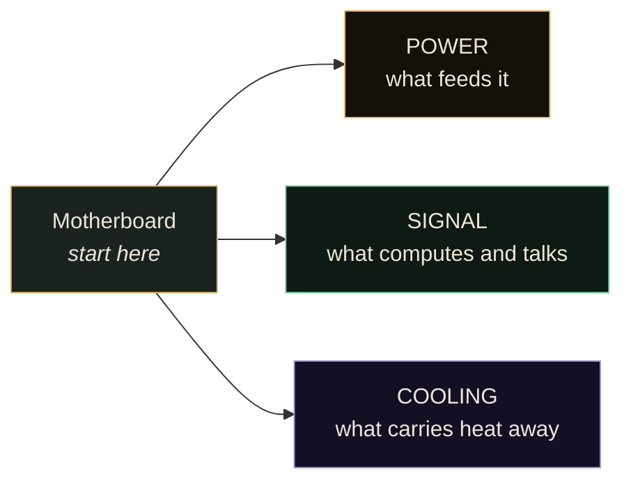
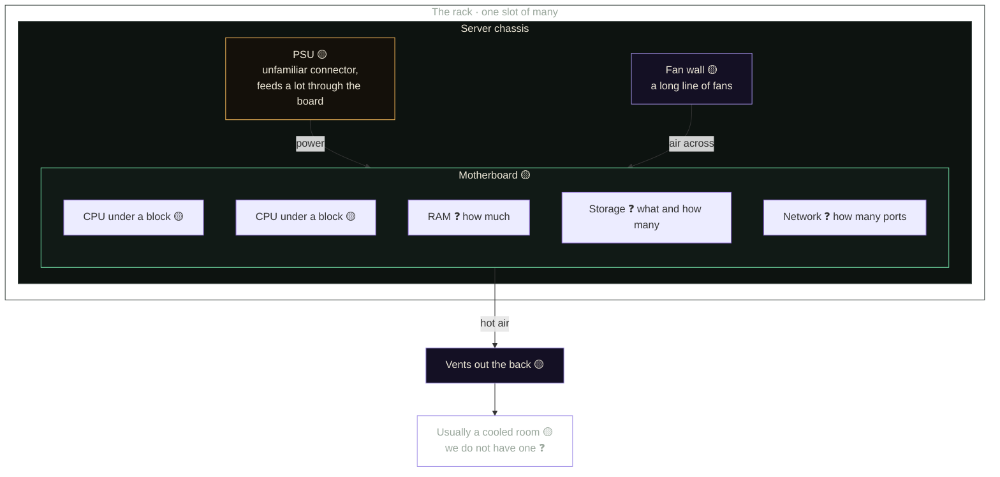

# The server, read three ways

The Hub has a rackmount server standing in the makerspace. This is a map of it,
started from Bryan's walk-around on 27 August 2026 and meant to be corrected by
whoever opens it next.

**Read this before you trust it.** Bryan was seeing the machine for the first
time and said so twice: *"everything I say here, take it with a grain of salt"*
and *"as I talk, I'm figuring out what needs to be done"*. Everything below is
marked for how sure we are. **Nothing here has been verified against the
hardware with the lid off.**

| mark | means |
|---|---|
| ✅ | confirmed by someone who checked the machine |
| 🟡 | Bryan said it while looking at it, unverified |
| ❓ | open question, nobody knows yet |

---

## The method

Bryan's, not ours, and it is the most portable thing in the recording. Any
computer breaks into **three systems**. Start at the motherboard and work
outwards through each in turn.

A server is not a different kind of machine, it is a different **shape** of one.
ATX and ITX are the desktop formats; this is a server format built to slide into
a rack with other machines stacked above and below. 🟡

---

## The machine

---

## 1. Power 🟡

The PSU is the power supply unit. Bryan flagged the connector as one he had not
seen before: rather than a long cable running out to every device separately, a
lot appears to be fed **through the motherboard**. He marked this as a guess and
so do we.

- 🟡 PSU present, appears to feed most things via the board
- ❓ Wattage, redundancy, whether there are two PSUs (common in servers)
- ❓ Whether anything still needs cabling. It was working when it was last set
  up, and nobody in the room at the time could confirm its current state
- ❓ Input: what it expects from the wall, and what the makerspace circuit gives

## 2. Signal 🟡

Everything that computes or carries data. Almost entirely unmapped, because the
walk-around did not get this far before the recording ended.

- 🟡 At least two CPUs, sitting under the cooling blocks
- 🟡 A CPU is a square of silicon under a metal lid, pasted to the heat sink
- ❓ RAM: how many sticks, what size, how many slots free
- ❓ Storage: how many drives, what kind, whether there is a RAID controller
- ❓ Network: how many ports, what speed
- ❓ What is installed on it, if anything

## 3. Cooling 🟡

The part that makes a server look like a server.

- 🟡 A long fan wall pushes air across the board and out through the back
- 🟡 Passive blocks over the CPUs. They come off, but the **thermal paste has to
  be redone** if they do
- 🟡 Full racks normally sit in a refrigerated room
- ❓ We do not have a cooled room. Where this machine lives, and how loud it is
  where it lives, is an open question and probably the first practical one
- 🟡 Water cooling is the alternative: a block that moves heat into flowing water

---

## What is actually blocking

In the order somebody could clear them.

| # | question | who could answer |
|---|---|---|
| 1 | Does it still need power cables? | whoever set it up, or whoever opens it next |
| 2 | Who can mount it in a rack? | open |
| 3 | Where does it live, given the noise and no cooled room? | the house |
| 4 | What is inside: RAM, storage, network? | anyone with a screwdriver and ten minutes |
| 5 | What is it for? See below | the tech track |

## What it could be for

Nothing here is decided. Listed so two people do not build the same half.

- **The thing the valley stops renting.** Everything currently depends on an
  uplink to a hosted database and an edge network. A machine in the building is
  the biggest single change available to that.
- **A local archive node.** The same knowledge, fast and offline, on a box in
  this building. See Build 2 in the [projects index](https://github.com/Valley-of-the-Commons/projects).
- **Permanent storage.** Build 1.
- **The thing Rolling Rob and the LoRa devices talk to** when the internet is
  not there.

---

## How to correct this

Open it, look, and change the marks. A 🟡 that you verified becomes ✅ with your
name beside it. A ❓ you answered becomes a line of fact. If Bryan got something
wrong, say so plainly and leave the original in the recording, which is the
record.

The recording itself is 2 minutes 57 seconds and lives in the Hub under
**"Bryan opens the server: power, signal, cooling"**.

*Started 27 Aug 2026 from Bryan's walk-around, at the tech track.*
